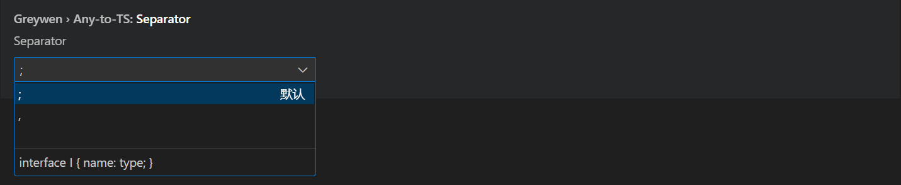

**[简体中文](README_CN.md)** | **English**

# Any to TS: VSCode Extension

## Overview
"Any to TS" is a powerful VSCode extension designed to convert any object into TypeScript types or interfaces. This tool extends the functionality of [vscode-json-to-ts](https://github.com/MariusAlch/vscode-json-to-ts), providing a set of convenient features to help developers handle TypeScript type definitions more efficiently.

## Core Features

### Legacy Features Retained
- **Clipboard Conversion `Ctrl + Shift + Alt + V`**: Instantly retrieves JSON data from the clipboard and converts it into TypeScript types.
- **Convert from Selection `Ctrl + Shift + Alt + S`**: Converts selected JSON data from the editor directly into TypeScript types.

### New Features
- **Toggle Type Alias `Shift + Ctrl + Alt + T`**: Use a shortcut key to switch between `type` and `interface`, enabling flexible data structure definitions.
- **AI-Assisted Conversion**: Leverages AI to analyze JSON data that cannot be converted or throws errors with JSON-TO-TS, and provides the correct TypeScript type definitions.

### Key Feature Demonstrations

#### Convert from Clipboard
By using the shortcut `Ctrl + Shift + Alt + V`, users can quickly convert JSON data from the clipboard into TypeScript types. This significantly streamlines the process of defining types from external data sources.

#### Convert from Selection
With `Ctrl + Shift + Alt + S`, users can select JSON data within the editor and generate corresponding TypeScript types in real time. This is particularly useful during code editing for rapid type definition generation.

#### Switch Conversion Type
By pressing `Ctrl + Shift + Alt + T`, users can seamlessly toggle between `type` and `interface`. This allows developers to choose the most appropriate type definition based on specific requirements.

#### Add Separator Setting

#### Enable AI Large Models
"Any to TS" supports AI-powered analysis of complex or malformed JSON data, generating accurate TypeScript type definitions.

Supported AI models include, but are not limited to:
- OpenAI
    - GPT-4o
    - GPT-4o-mini
- Claude
    - 3.7 Sonnet
- DeepSeek
    - deepseek-chat
- Dashscope
    - qwen-max
    - qwen-plus
    - qwen2.5-72b-instruct
- Gemini
    - gemini-2.0-pro-exp
- Moonshot
    - moonshot-v1-8k
    - moonshot-v1-32k
    - moonshot-v1-128k

#### Large Model Configuration

*You can configure your preferred AI model based on your needs or latency feedback.*

VS Code -> Settings -> Any To TS Settings
- Select `UseLLM`
- Base URL: `https://api.deepseek.com`
- API Key: `sk-*****`
- Model Name: `deepseek-chat`

## Supported Conversion Features

- **Array Type Merging (**Crucial Feature**)**: Automatically merges array types, simplifying complex data structures.
- **Duplicate Type Prevention**: Avoids redundant type definitions to keep your codebase clean.
- **Union Types**: Supports union type definitions for greater flexibility.
- **Optional Types**: Allows defining optional properties to adapt to different data structures.
- **Array Types**: Handles array types to ensure data consistency.

## Links

- [vscode-json-to-ts](https://github.com/MariusAlch/vscode-json-to-ts)