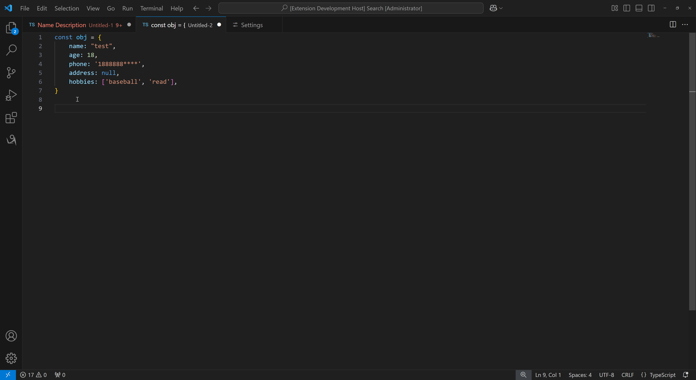
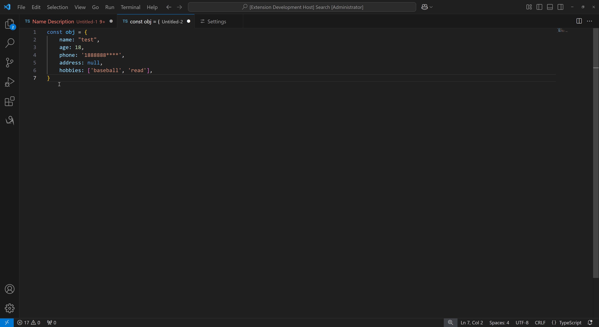
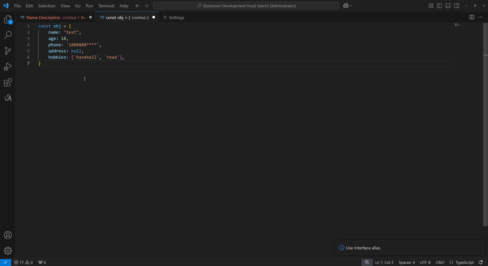
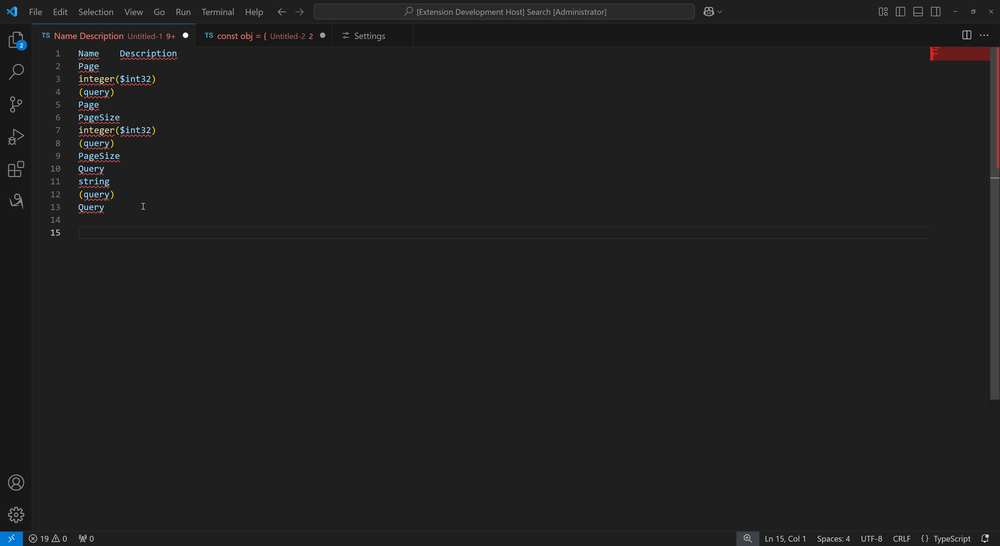

# Any to TS: VSCode 扩展插件

## 概述
"Any to TS" 是一个强大的 VSCode 扩展插件，旨在将任何对象转换为 TypeScript 类型或接口。该工具基于 [vscode-json-to-ts](https://github.com/MariusAlch/vscode-json-to-ts) 进行功能扩展，提供了一系列便捷的功能，帮助开发者更高效地处理 TypeScript 类型定义。

## 核心功能

### 传统功能保留
- 剪贴板转换 `Ctrl + Shift + Alt + V`: 直接从剪贴板获取 JSON 数据并转换为 TypeScript 类型。
- 从选择转换 `Ctrl + Shift + Alt + S`: 选择编辑器中的 JSON 数据并进行转换。

### 新增功能
- 切换类型别名 `Shift + Ctrl + Alt + T`: 通过快捷键在 type 和 interface 之间切换，灵活定义数据结构。
- AI 辅助转换：利用 AI 对 JSON-TO-TS 无法转换或转换报错的类型进行分析，提供正确的 TypeScript 类型定义。

### 主要功能展示

#### 从剪贴板转换
使用快捷键 Ctrl + Shift + Alt + V，用户可以快速将剪贴板中的 JSON 数据转换为 TypeScript 类型。这一功能极大地简化了从外部数据源获取类型定义的过程。

#### 从选择转换
通过 Ctrl + Shift + Alt + S，用户可以选择编辑器中的 JSON 数据并进行转换。这一功能使得在代码编辑过程中，快速生成类型定义成为可能。

#### 切换转换类型
使用 Ctrl + Shift + Alt + T，用户可以在 type 和 interface 之间进行切换。这一功能允许开发者根据具体需求选择最合适的类型定义方式。

#### 启用 AI 大模型
"Any to TS" 支持通过 AI 对复杂或错误的 JSON 数据进行分析，生成正确的 TypeScript 类型定义。

支持的 AI 模型包括但不限于：
- OpenAI
	GPT-4o
	GPT-4o-mini
- Claude
	3.7 Sonnet
- DeekSeek
	deepseek-chat
- Dashscope
	qwen-max
	qwen-plus
	qwen2.5-72b-instruct
- Gemini
	gemini-2.0-pro-exp
- Moonshot
	moonshot-v1-8k
	moonshot-v1-32k
	moonshot-v1-128k

#### 大模型配置

`可以根据自己的喜欢/反馈速度配置自己的大模型`

VS Code -> Settings -> Any To TS Settings
- 选中 UseLLM
- Base URL : https://api.deepseek.com
- API Key : sk-*****
- Model Name : deepseek-chat

## 支持转换类型

- Array type merging (**Huge deal**): 自动合并数组类型，简化复杂数据结构。
- Duplicate type prevention: 防止重复类型定义，保持代码整洁。
- Union types : 支持联合类型定义，增强类型灵活性。
- Optional types : 允许定义可选属性，适应不同数据结构。
- Array types : 处理数组类型，确保数据一致性。

## 链接

- [vscode-json-to-ts](https://github.com/MariusAlch/vscode-json-to-ts)